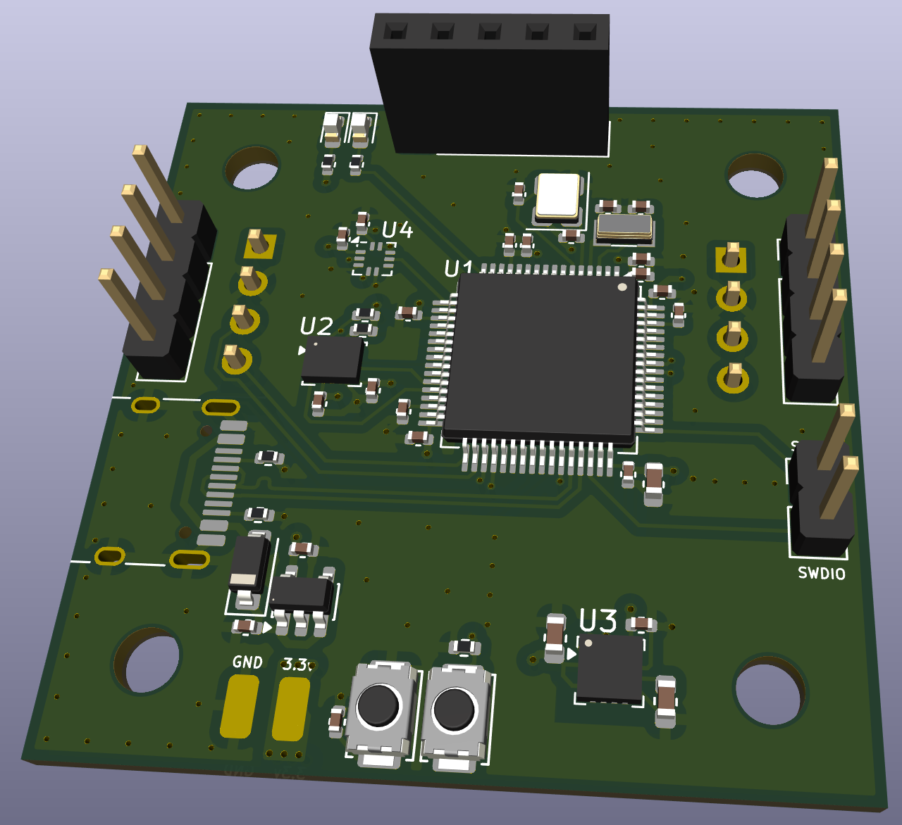
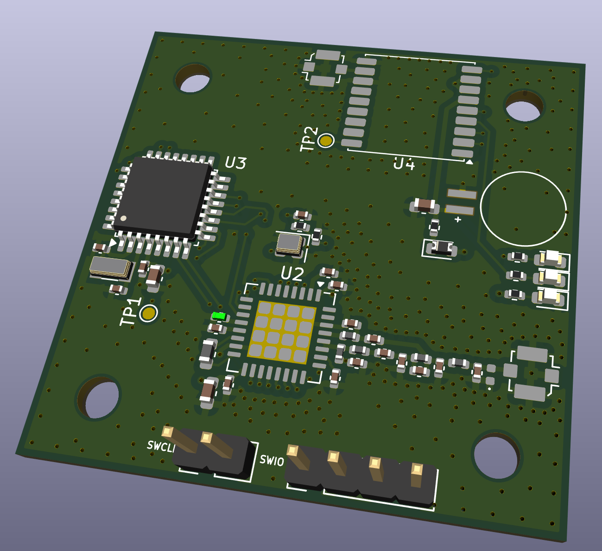
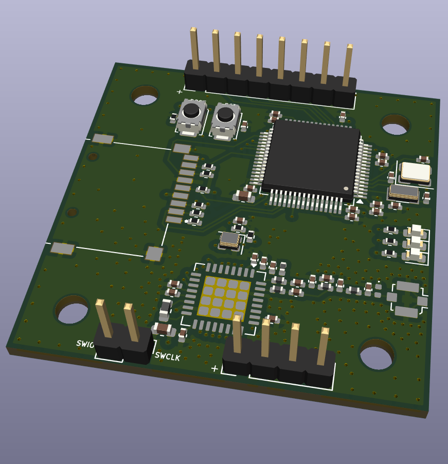
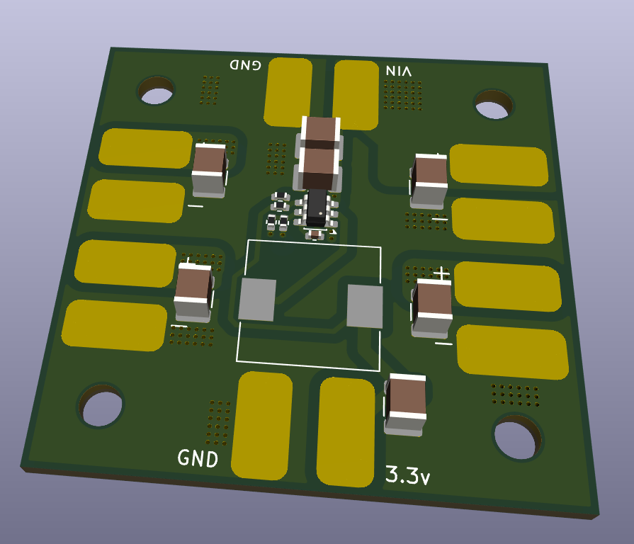
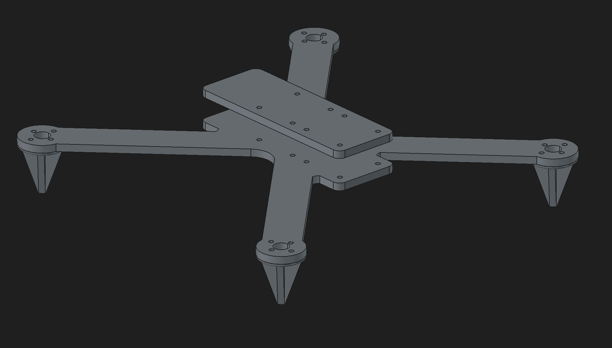

# Shadowfax
FPV Drone designed from scrach. This design isn't fully custom yet but will get there eventually. I started this project to make a cool drone and learn as much as I can about engineering.

## Flight Controller
The meat and potatios, the main computer for the drone.

## Transceiver
A low frequency radio to communicate with a remote controller.

## Camera Controller
Controls the camera and captures videos and pictures with a high frequency radio for faster communication.

## Power Board
Powers the whole stack with 3.3v and connects the ESCs to the input voltage.

## Frame
I made a custom frame to fit my custom boards and here it is.

